# Harsh Awasthi

### B.Tech CSE Student · Web Developer · AI Enthusiast

<table align="center" border="0" cellpadding="0" cellspacing="0">
  <tr>
    <td valign="top" width="370">
      
    </td>
    <td valign="top" width="490">
      
    </td>
  </tr>
</table>

 

  

 

<h2 align="center">🐍 Contribution Snake</h2>

<picture>
  <source media="(prefers-color-scheme: dark)" srcset="https://raw.githubusercontent.com/ogharsh-2025/ogharsh-2025/output/github-contribution-grid-snake-dark.svg">
  <source media="(prefers-color-scheme: light)" srcset="https://raw.githubusercontent.com/ogharsh-2025/ogharsh-2025/output/github-contribution-grid-snake.svg">
  
</picture>

 

  <a href="https://ogharsh-2025.github.io/">Portfolio</a> &nbsp;·&nbsp;
  <a href="https://www.linkedin.com/in/harsh-awasthi-117411297/">LinkedIn</a> &nbsp;·&nbsp;
  <a href="https://www.instagram.com/averageboyharsh/">Instagram</a>

